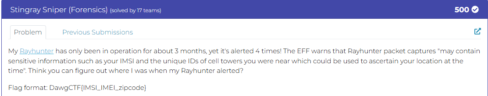
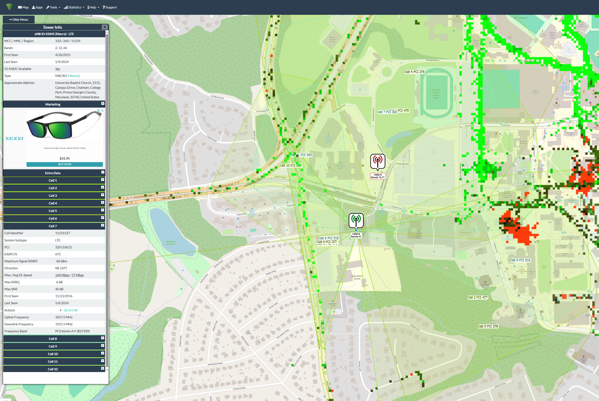

# Stingray Sniper

#### Only 17 solves!



Download Challenge File(s): [Click Here](./1742587911.pcap)


I had to learn quite a bit about the packets and data that is sent for cellular communications in this challenge! Main goal here was to obtain IMSI, IMEI, and zipcode of the area the device was used.

#### IMSI Retrieval:
The first piece of information I found was the IMSI. I started looking at the first PDN connectivity request I saw. Within this I could see a GSM TAP header > Non-Access-Stratum PDU which helped confirm that the EPS attach type was IMSI. This packet also showed useful information such as Mobile Country Code (United States 310), Mobile Network Code (T-Mobile 260), and Tracking Area Code (20439).

Further down I learned the importance of the Identity request, which I could see was Identity type 2: IMSI. Looking at the Identity response, following the GSM TAP header > Non-Access-Stratum PDU > Mobile Identity clearly revealed the IMSI as ```310240191383963```

Now I started looking for the IMEI. I spent quite some time trying to figure out which packets may reveal this, but none of the indenty requests were of Type 2 IMEI. They were always Type 1 IMSI or Type 3 IMEISV. 

#### IMEI Retrieval
After some more research into how I could obtain the IMEI, i learned that it can be derived from the IMEISV as this value is the IMEI with a Software Version (SV) appended. This is where the [Luhn Algorithm](https://stripe.com/en-ca/resources/more/how-to-use-the-luhn-algorithm-a-guide-in-applications-for-businesses) could be used to derive and validate a proper IMEI.

After entering the partial IMEI (first 14 digits from the IMEISV) into a tool such as [IMEI.info](https://www.imei.info/?imei=353977577332846), I could use the calculator on ```35397757733284``` to find out that the 15th digit (check digit) was 6. Therefore the IMEI, confirmed to be valid, was ```353977577332846```

#### Zip code Retrieval:
There felt like many red herrings for this step, as there were quite a bit of KTE SystemInformation checks that didn't end up matching to the correct connection that would reveal where the user was roughly located. 

I spent an extensive amount of time manually navigating the tool cellmapper.net to try and find the original TAC of 20439. With only this information, I could not manage to determine a proper Cell ID, a more accurate way to find a tower. This led to guessing some Zip codes for that TAC area of 20439, and a lot of guessed flag submissions/

After eventually looking at the SystemInformationBlockType1 packets in more detail, I found that they reveal a section under LTE Radio Resource Control with the TAC again, as well as a cellID! A cellID means we can start searching for towers specifically. There was only one SystemInformationBlockType1 close to the original TAC, this time with 20440. Cell ID of 11531527.

Using the Cell ID Calculator on cellmapper, I got [these results](https://www.cellmapper.net/enbid?net=LTE&cellid=11531527) which gave me an eNB ID of 45045. I could now use the Tower Search tool on cellmapper to find this exact tower based on this eNB ID



Knowing that I was looking for cell 7 based on the cellmapper calc results, I could see that cell was PCI 320 covering the Ludwig Field. A quick google search of Ludwig Field had the Zip code as ```20742```

#### Final Flag

Putting this all together for a correct submission of the following flag: ```DawgCTF{310240191383963_353977577332846_20472}```


